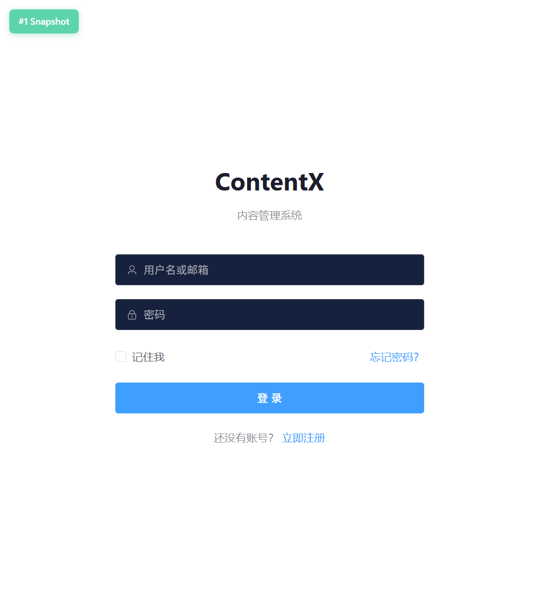
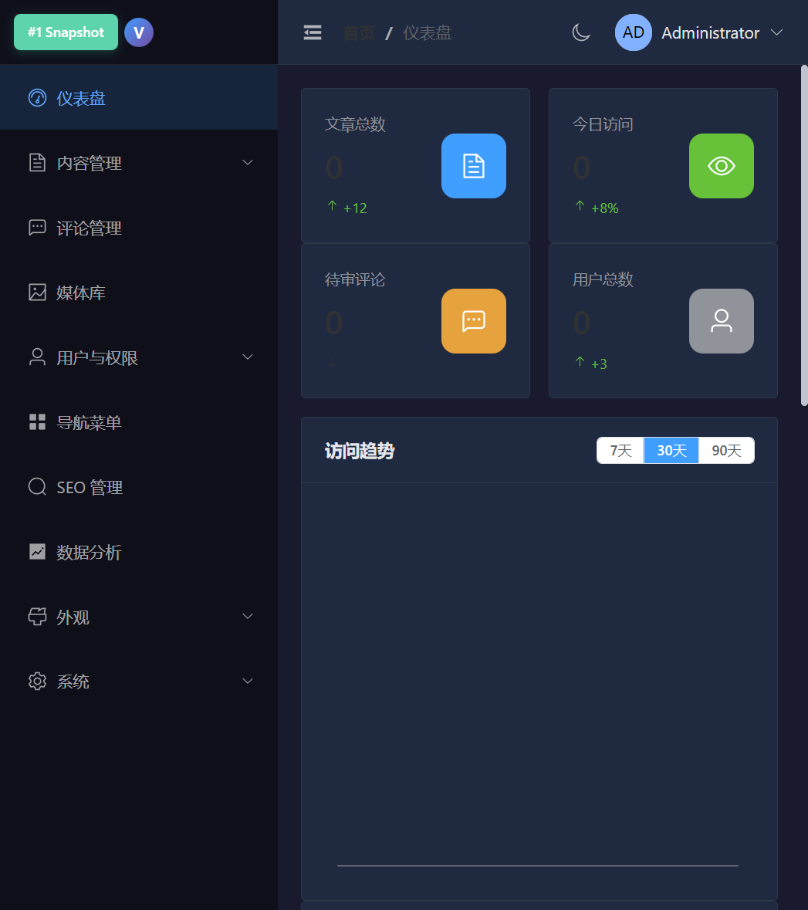
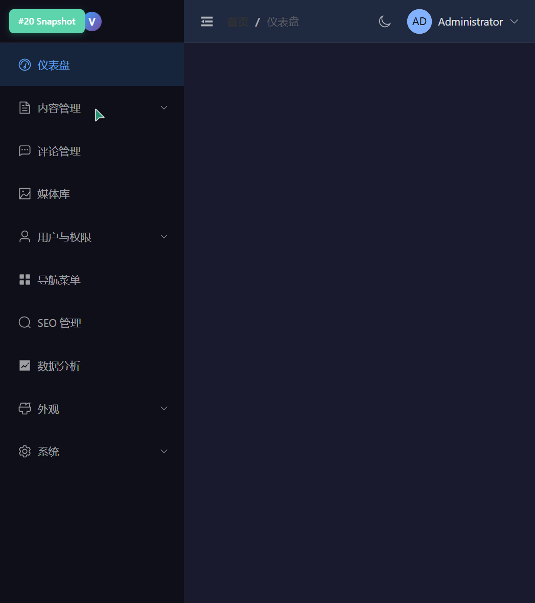
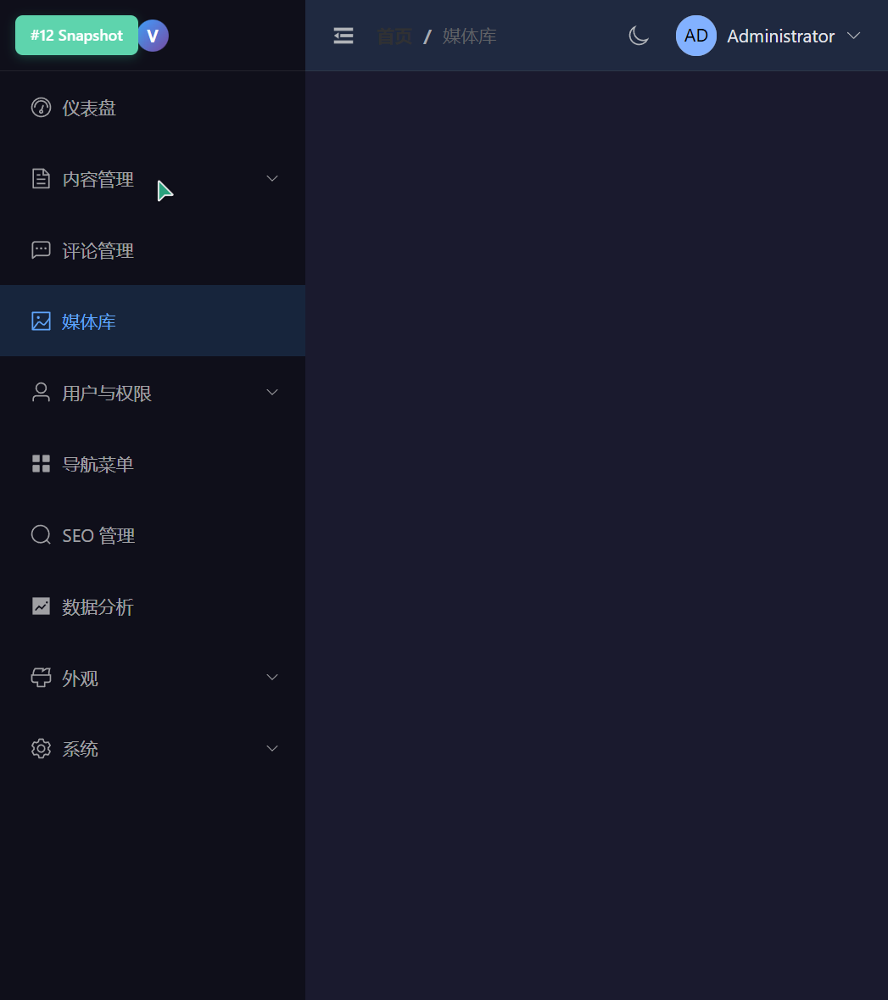
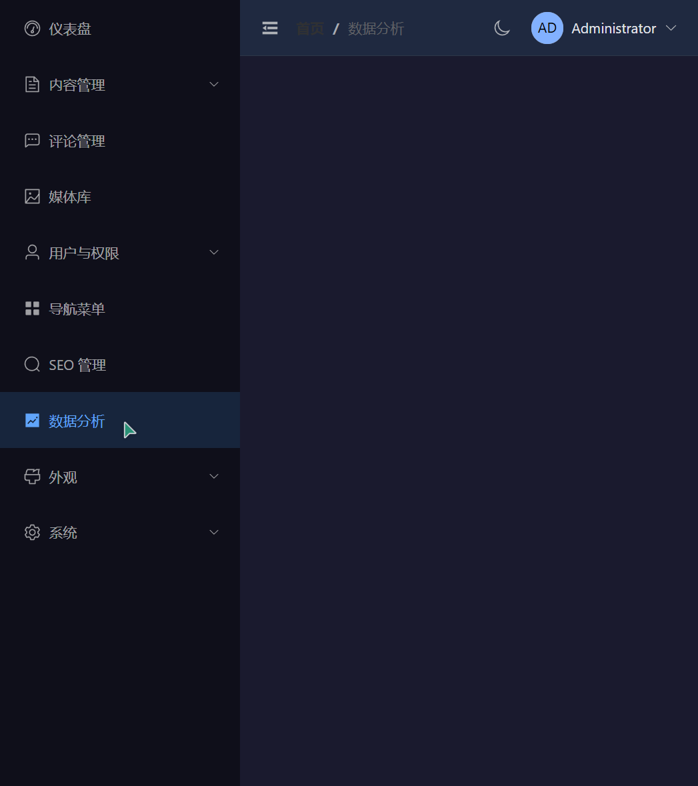
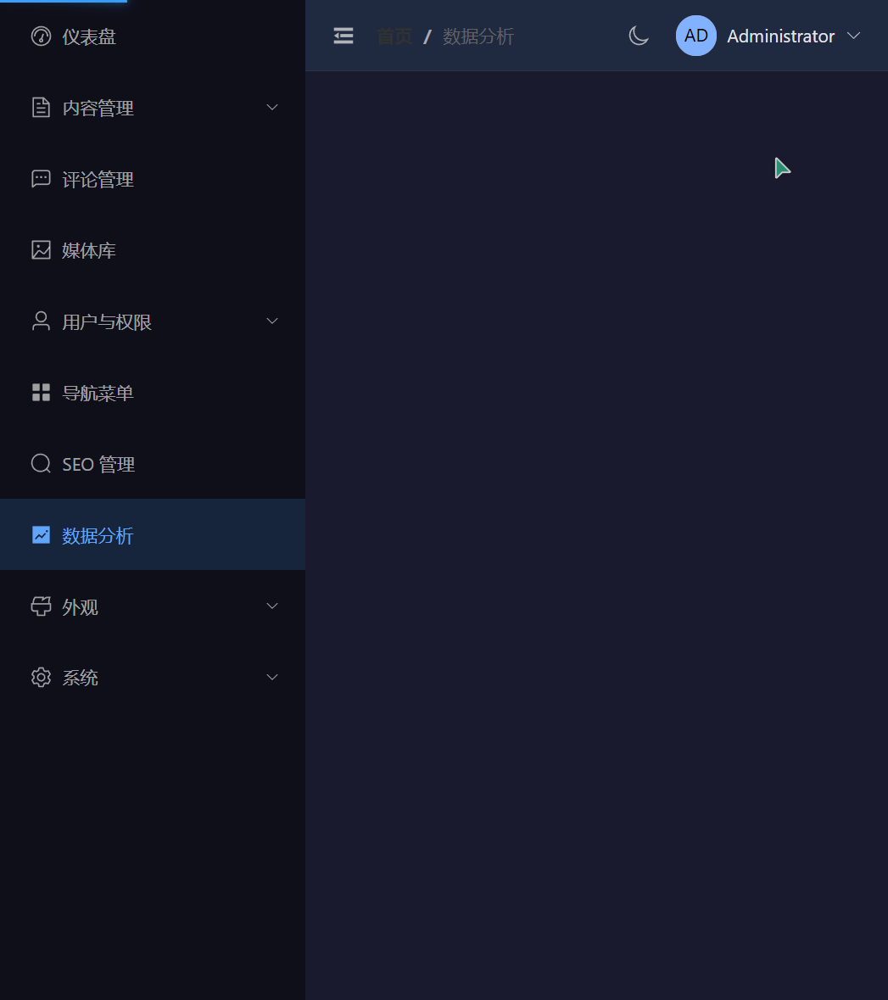

# 🌪️ ContentX

> **高性能 Go Headless CMS** — API-first 内容平台，单二进制部署，自定义内容类型，REST + GraphQL 双 API，多语言内容，插件扩展。

[](https://go.dev)
[](/swagger/index.html)
[](/api/v1/graphql)
[](./LICENSE)

---

## 为什么选 ContentX

| | ContentX | Strapi | Ghost |
|---|-----------|--------|-------|
| 语言 | **Go** | Node.js | Node.js |
| 内存占用 | **~30MB** | ~200MB | ~150MB |
| Docker 镜像 | **< 30MB** | ~500MB | ~400MB |
| 部署方式 | **单二进制** | npm + Node | npm + Node |
| 自定义内容类型 | ✅ | ✅ | ❌ |
| REST + GraphQL | ✅ 双 API | ✅ | ❌ |
| 多语言内容 (i18n) | ✅ | ✅ | ❌ |
| 发布工作流 | ✅ 6 态状态机 | ✅ | ⚠️ 2 态 |
| 插件系统 | ✅ Hook/Filter | ✅ | ✅ |
| Webhook | ✅ | ✅ | ✅ |
| API Token | ✅ 细粒度 | ✅ | ❌ |
| SDK | TypeScript | JS/TS | ❌ |
| SQLite 零依赖 | ✅ | ❌ | ❌ |

---

## 核心能力

### 🧩 自定义内容类型

像 Strapi 一样定义内容结构，自动生成 CRUD API：

```bash
# 创建 "产品" 内容类型
curl -X POST /api/v1/content-types \
  -H "Authorization: Bearer {token}" \
  -d '{
    "uid": "product",
    "name": "产品",
    "fields": [
      {"name": "title", "label": "标题", "field_type": "text", "required": true},
      {"name": "price", "label": "价格", "field_type": "float", "min_value": 0},
      {"name": "status", "label": "状态", "field_type": "enum", "options": ["在售", "下架"]}
    ]
  }'

# 自动生成的 API：
# GET    /api/v1/content/product           # 列表
# GET    /api/v1/content/product/:id       # 详情
# POST   /api/v1/content/product           # 创建
# PUT    /api/v1/content/product/:id       # 更新
# DELETE /api/v1/content/product/:id       # 删除
# POST   /api/v1/content/product/:id/publish   # 发布
```

### 🔐 API Token 系统

```bash
# 创建细粒度 Token
curl -X POST /api/v1/system/tokens \
  -d '{"name":"Next.js","permissions":["articles.read","categories.read"]}'
# → vc_live_aa3f2a989d57960db02e3328ffe5b079
```

### 🌐 多语言内容 (i18n)

为文章和自定义内容创建多语言翻译版本，通过 `TranslationGroupID` 关联：

```bash
# 为文章创建中文翻译
curl -X POST /api/v1/articles/42/translations?locale=zh \
  -H "Authorization: Bearer {token}" \
  -d '{"title":"你好世界","content":"<p>内容</p>"}'

# 列出文章的所有翻译
curl /api/v1/articles/42/translations

# 按语言筛选文章列表
curl /api/v1/articles?locale=zh
```

支持 BCP-47 语言标签（`en`/`zh`/`ja` 等），翻译自动继承源文章的分类、标签、特色图等元数据。

### 🚀 GraphQL API

只读 GraphQL 端点，适合前端灵活查询，复用 REST 同一 Service 层：

```bash
# POST /api/v1/graphql
curl -X POST /api/v1/graphql \
  -d '{"query":"{ articles(page:1,pageSize:5){ total items{ title slug author{ displayName } comments{ content } } } }"}'

# GET /api/v1/graphql?query=...
curl "/api/v1/graphql?query={ articles { items { title } } }"
```

6 个对象类型（Article/User/Category/Tag/Comment/ArticleConnection）+ 10 个 Query 字段，支持嵌套关系和分页。敏感字段（password/email）自动排除。

### 📋 发布工作流

6 态发布状态机，支持审核流程和定时发布：

```
draft → pending → published → archived
  ↘         ↗        ↙
   trash ←──── scheduled
```

```bash
# 提交审核
curl -X POST /api/v1/articles/42/submit-review
# 审核通过并发布
curl -X POST /api/v1/articles/42/approve
# 定时发布
curl -X POST /api/v1/articles/42/schedule -d '{"publish_at":"2026-08-01T10:00:00Z"}'
# 归档
curl -X POST /api/v1/articles/42/archive
```

`PublishScheduler` 后台 worker 自动执行定时发布任务。

### 🔌 插件系统

Go 接口 + Hook/Filter 机制，运行时启用/禁用，配置热重载：

```go
// 实现 Plugin 接口
type MyPlugin struct{}
func (p *MyPlugin) Name() string { return "my-plugin" }
func (p *MyPlugin) Hooks() []plugin.HookRegistration {
    return []plugin.HookRegistration{
        {Name: "article.afterCreate", Type: plugin.HookAction, Fn: p.onCreated},
        {Name: "article.filterContent", Type: plugin.HookFilter, Fn: p.transform},
    }
}
```

```bash
# 运行时启用/禁用/配置
curl -X POST /api/v1/plugins/1/enable
curl -X PUT /api/v1/plugins/1/config -d '{"verbose":true}'
```

内置 `WordCountPlugin` 示例：文章创建/删除时记录字数日志，内容保存前规范化空白字符。

### 🪝 Webhook

内容变更时自动通知外部系统，支持 HMAC 签名，覆盖 8 类业务事件（文章/评论/媒体/用户的 CRUD）：

```bash
curl -X POST /api/v1/webhooks \
  -d '{"name":"Discord","url":"https://hooks.example.com","events":["entry.create","entry.publish"]}'
```

### 📖 Swagger 文档

启动后访问 `http://localhost:8080/swagger/index.html`，114 个方法中 95.6% 有 OpenAPI 注解。

---

## 界面预览

| 登录 | 仪表盘 |
|:---:|:---:|
|  |  |

| 文章管理 | 媒体库 |
|:---:|:---:|
|  |  |

| 数据分析 | 系统设置 |
|:---:|:---:|
|  |  |

---

## 快速开始

### 仅需 Go

```bash
git clone https://github.com/yamovo/contentx.git
cd contentx
go run cmd/server/main.go

# API:     http://localhost:8080/api/v1
# Swagger: http://localhost:8080/swagger/index.html
# 账号:    admin（密码在启动日志中自动生成，或设置 ADMIN_PASSWORD 环境变量）
```

### TypeScript SDK

```bash
npm install @contentx/sdk
```

```typescript
import { ContentX } from '@contentx/sdk'

const cms = new ContentX({
  baseURL: 'http://localhost:8080/api/v1',
  token: 'vc_live_...',
})

// 内置内容（按语言筛选）
const articles = await cms.articles.list({ status: 'published', locale: 'zh' })

// 动态内容类型
const products = await cms.content('product').list()
await cms.content('product').create({
  data: { title: 'Go 语言圣经', price: 99.9, status: '在售' }
})
```

---

## API 概览

| 分组 | 接口数 | 说明 |
|------|--------|------|
| Auth | 7 | 登录、注册、Token 刷新、个人信息 |
| Articles | 16 | CRUD、批量操作、版本历史、RSS、发布工作流（6 态）、翻译 |
| GraphQL | 2 | 只读查询端点（GET + POST） |
| Content Types | 4 | 自定义内容类型管理 |
| Content Entries | 10 | 动态内容 CRUD + 发布/取消发布 + 翻译 |
| Categories | 6 | 树形分类、拖拽排序 |
| Tags | 6 | 增删改查、标签合并 |
| Comments | 9 | 审核、垃圾标记、批量操作 |
| Media | 8 | 上传（单/批量）、文件夹管理、S3/本地双路径 |
| Users & Roles | 8 | 用户管理、角色权限分配 |
| Plugins | 4 | 列表、启用/禁用、配置更新 |
| Webhooks | 4 | 配置、日志查看 |
| API Tokens | 3 | 创建、列表、删除 |
| SEO | 5 | Meta、Sitemap、重定向 |
| System | 3 | 系统信息、健康检查、活动日志 |

> 完整文档：启动后访问 `/swagger/index.html`

---

## 项目结构

```
contentx/
├── cmd/server/main.go          # 入口
├── internal/
│   ├── auth/                   # JWT、密码、API Key、TOTP
│   ├── config/                 # 30+ 环境变量
│   ├── database/               # 连接、迁移、种子
│   ├── errs/                   # 统一错误码体系
│   ├── graphql/                # GraphQL schema + resolvers
│   ├── models/                 # 数据模型（含动态内容类型、i18n 字段）
│   ├── handlers/               # HTTP 处理器（Swagger 注解 95.6%）
│   ├── middleware/             # 认证、限流、CORS、RBAC
│   ├── plugin/                 # 插件接口 + Hook/Filter + Manager
│   ├── repository/             # GORM 仓库接口层（12 个 Service 全量重构）
│   ├── services/               # 业务逻辑层（覆盖率 83.5%）
│   ├── storage/                # 存储驱动（Local / S3）
│   └── cache/                  # 缓存驱动（Memory / Redis）
├── sdk/typescript/             # TypeScript SDK
├── docs/
│   └── api/                    # Swagger JSON/YAML
└── web/                        # Vue 3 管理后台
```

---

## 配置

```env
# 数据库
DB_DRIVER=sqlite               # postgres | mysql | sqlite

# 服务器
SERVER_PORT=8080
SERVER_MODE=debug              # debug | release

# 认证
JWT_SECRET=your-secret-key

# 存储
STORAGE_DRIVER=local           # local | s3
S3_ENDPOINT=minio:9000
S3_BUCKET=contentx

# 缓存
CACHE_DRIVER=memory            # memory | redis
REDIS_ADDR=localhost:6379

# 多语言 (i18n)
I18N_DEFAULT_LOCALE=en         # 默认语言
I18N_LOCALES=en,zh,ja          # 支持的语言列表（逗号分隔）
```

---

## 测试

```bash
go test ./...                       # 全部测试
go test ./internal/services/ -v     # Service 层（含 i18n、工作流、mock）
go test ./internal/graphql/ -v      # GraphQL schema + resolvers
go test ./internal/plugin/ -v       # 插件 Manager + Hook/Filter
```

---

## 技术栈

| 层级 | 技术 |
|------|------|
| 后端 | Go 1.22+ / Gin / GORM |
| 数据库 | PostgreSQL / MySQL / SQLite |
| API | REST + GraphQL（只读） |
| 认证 | JWT + API Token + RBAC + TOTP |
| 多语言 | BCP-47 Locale + TranslationGroup |
| 插件 | Plugin 接口 + Hook/Filter + Manager |
| 文档 | Swagger / OpenAPI 2.0（95.6% 覆盖） |
| 存储 | Local / S3 兼容 |
| 缓存 | Memory / Redis |
| 前端 | Vue 3 + TypeScript + Element Plus |
| SDK | TypeScript (@contentx/sdk) |

---

## License

MIT © 2026 ContentX
