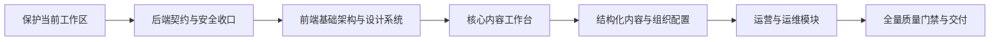

# ContentX 管理后台重构实施方案

> **【已归档 2026-07-28】** 五个实施阶段均已完成，本文档不再维护。
> 遗留事项已收敛至[项目状态](../STATUS.md)与[路线图](../ROADMAP.md)；
> 当时的问题清单保存在[归档快照](./ISSUES-2026-07-29.md)中。

> 状态：已完成，归档保存  
> 日期：2026-07-28  
> 适用范围：后端阻断项收口、Vue 管理后台渐进式重构

## 进度摘要

| 阶段 | 状态 | 说明 |
|---|---|---|
| 阶段 1：前端基础与后台骨架 | **已完成** | Vue Query 全面采用，FDI 分层架构建立，`pages/` 薄壳统一路由入口 |
| 阶段 2：核心内容工作台 | **已完成** | ArticleList/Editor/Revisions、CommentList、MediaLibrary 均已迁移至 `pages/` 薄壳 |
| 阶段 3–5 | **视图迁移完成** | 所有视图已迁移至 Vue Query，路由统一指向 `pages/`，待进一步验收 |

> 备注：`content-types`、`content/:uid` 和 404 路由仍指向 `views/`，尚未建立 `pages/` 薄壳，留待后续阶段处理。

## 1. 结论与已确认决策

ContentX 后端的分层架构、数据库支持、可观测性和基础测试体系可以继续使用，
不需要推倒重写；但权限、内容生命周期、公开 GraphQL、认证令牌和 REST 错误
协议存在会直接影响新前端的阻断问题，必须先收口。

前端采用以下已确认方向：

- 管理后台优先，公共首页、博客和公开注册暂不作为生产入口。
- 保留 Vue 3、TypeScript、Vite、Pinia、Vue Router 和 Element Plus。
- 采用渐进式重构，不切换到 React，也不进行一次性大爆炸重写。
- 视觉定位为专业内容工作台：克制、清晰、中等信息密度。
- 分阶段覆盖全部后台，每阶段独立验收。
- 编辑器继续使用 Markdown，不在本轮引入富文本内容迁移。
- 以 1440px 桌面为主设计宽度，1024px 可完整操作；手机仅保证登录和基础查看。



## 2. 当前基线

### 2.1 后端

- `go vet ./...` 已通过。
- 全量测试在外层 120 秒限制下未跑完；按包分组后全部通过，没有发现单包挂死。
- Handler 和 Service 测试耗时较长，最终验证需允许至少 5 分钟。
- 当前主要风险来自接口契约和授权逻辑，而不是底层架构整体不可用。

### 2.2 前端

- TypeScript 类型检查通过。
- 12 个测试文件、150 项单测通过，但测试输出含大量 Vue、Router 和
  `window.scrollTo` 警告。
- 生产构建通过，但存在约 511KB 的分块警告和 Sass legacy API 警告。
- CI 同款覆盖率检查低于现有门槛，多个后台页面覆盖率为 0。
- E2E 主要覆盖认证和冒烟流程，尚未覆盖内容发布、权限、媒体和系统管理。

### 2.3 工作区保护

当前仓库包含大量已修改、已删除和未跟踪文件。实施时将当前工作树视为基线：

- 不执行 `git reset --hard`、批量恢复或覆盖现有改动。
- 开始修改前记录完整 `git status` 和二进制 diff 备份。
- 按后端契约、前端基础、页面批次分别审查变更。
- 不恢复此前已删除的旧说明文档和截图。

## 3. 后端前置整改

### 3.1 权限模型

新增统一权限注册表，路由、中间件、默认角色、MCP、API Token 和前端均从该
注册表派生，禁止继续散落裸字符串。

Canonical 权限采用动作型命名：

- 通用动作：`read`、`create`、`update`、`delete`
- 跨所有者动作：`update_all`、`delete_all`
- 业务动作：`articles.publish`、`comments.moderate`、`content.publish`

默认角色矩阵：

| 角色 | 内容权限 | 发布权限 | 其他后台权限 |
|---|---|---|---|
| Author | 读取、创建、更新和删除本人内容 | 无，可提交审核 | 读取分类/标签，上传和读取媒体 |
| Editor | Author 权限及跨作者更新/删除 | 发布、取消发布、定时、审核、归档 | 分类/标签管理、评论审核、媒体管理 |
| Admin | 全部 | 全部 | 全部 |
| Subscriber | 不进入管理工作台 | 无 | 仅保留 API 侧个人能力 |

兼容策略：

- 数据库迁移逐项 upsert Canonical 权限并修复默认角色关联。
- `view → read`、`edit → update`；旧 `manage` 展开为相应 CRUD 权限。
- 旧权限别名兼容一个发布周期，日志记录弃用提示。
- `/auth/me` 和新创建的 API Token 只返回 Canonical 权限。

### 3.2 内容生命周期

- 创建文章或页面时状态固定为 `draft`。
- 普通更新接口拒绝 `status`、`published_at`、`scheduled_at` 等生命周期字段。
- 发布、取消发布、提交审核、批准、定时和归档只通过专用端点执行。
- 发布类操作统一要求 `articles.publish`；提交审核只要求本人更新权限。
- `post_type` 创建后不可通过普通更新修改，避免页面被误存为文章。
- 批量操作按具体动作分别校验更新、删除或发布权限。

### 3.3 公开接口与认证安全

- 公共 GraphQL 和 slug 查询只返回 `published + public` 内容。
- 删除公开 GraphQL 的任意 `status` 过滤能力。
- GraphQL fragment 复杂度计算增加循环检测。
- 增加 `AUTH_ALLOW_REGISTRATION=false`；关闭时注册接口返回
  `REGISTRATION_DISABLED`。
- JWT 增加 `token_use` 和 JTI；Access Token 不得用于刷新。
- Refresh Token 每次刷新后轮换并吊销旧令牌，刷新路径必须检查吊销状态。
- TOTP 状态读取失败时采用 fail-closed，不得绕过二次验证。
- 该变更上线时现有登录会话统一失效，用户重新登录；API Token 不受影响。

公共博客本轮不新增 `/public/*` REST 接口。未来重新启用公共站点时，需单独
设计只读 Published 内容、匿名评论和点赞的限流及幂等协议。

### 3.4 REST 契约与 OpenAPI

普通 JSON REST 接口统一采用：

```ts
interface ApiEnvelope<T> {
  code: 0 | -1
  err_code?: string
  message: string
  data?: T
  meta?: {
    page: number
    page_size: number
    total: number
    has_next: boolean
    has_prev: boolean
  }
}
```

GraphQL、健康检查、RSS/XML 和二进制下载保留为显式特殊 Transport，不强行
包装。所有中间件、限流、认证、RBAC 和业务 Handler 的错误均使用稳定的
`err_code + message`。

补齐所有已挂载路由的 Swagger 注释并重新生成 `docs/api`。生成结果必须和
仓库零差异，前端类型由 OpenAPI 生成，不再手写重复的响应结构。

## 4. 前端技术方案

### 4.1 分层

前端按职责整理为以下逻辑层：

- `app`：启动、Router、Provider、全局错误边界。
- `shared`：UI 基础组件、设计令牌、HTTP Client、通用工具。
- `entities`：Article、Media、User、Role 等实体类型和查询键。
- `features`：登录、发布、审核、上传、批量操作等业务能力。
- `pages`：路由页面，只负责组合，不直接堆叠协议和状态逻辑。

新增 `@tanstack/vue-query` 管理服务器状态、缓存、并发去重、请求取消和失效；
Pinia 只保留认证会话、主题和界面偏好。

保留现有 Axios 刷新队列，但 HTTP 层不再直接弹 Toast。领域 API 返回业务对象
或统一的分页结果：

```ts
interface ApiError {
  status: number
  code: string
  message: string
  requestId?: string
}

interface PageResult<T> {
  items: T[]
  meta: ApiEnvelope<unknown>["meta"]
}
```

页面仅在一个责任点展示错误，401 统一清理会话并跳转登录，403 展示明确的
权限状态。禁止页面直接调用 `fetch` 或依赖多层 `.data.data`。

### 4.2 设计系统

Element Plus 继续作为底层能力，但页面不再直接随意拼装。建立本地 UI 层：

- `AppShell`
- `PageHeader`
- `FilterBar`
- `DataTablePage`
- `FormSection`
- `StatusBadge`
- `AsyncState`
- `EmptyState`
- `PermissionGate`
- 统一确认对话框和危险操作样式

使用语义 Design Token 统一背景、文本、边框、状态色、间距、字号、圆角、
阴影、层级和密度，并映射到 Element Plus CSS 变量。浅色为默认主题，暗色
保持功能等价，不使用远程字体。

所有异步页面必须明确区分：

- 首次加载
- 局部刷新
- 空数据
- 权限不足
- 请求失败及重试
- 保存成功
- 未保存离开

仪表盘只能展示真实数据；缺少比较周期或设备数据时显示“暂无数据”，不得
使用硬编码涨幅或伪造比例。

### 4.3 路由和生产入口

- `/`：未登录跳转 `/login`，已登录跳转 `/admin`。
- `/login`：保留密码、TOTP 和可靠的错误状态。
- `/register`、`/blog/*`：不挂载生产路由，源码保留供未来独立重构。
- 删除没有后端能力的“忘记密码”等假入口。
- 菜单、路由守卫和操作按钮共用生成的 `PermissionSlug`。
- 没有管理权限的 Subscriber 不进入后台空白页。

## 5. 分阶段实施

### 阶段 0：后端契约和安全收口

完成权限迁移、发布工作流、GraphQL 数据边界、Refresh Token、TOTP、
注册开关、统一错误协议和 OpenAPI。

退出条件：

- Author、Editor、Admin 权限集成测试通过。
- 普通创建/更新无法绕过发布权限。
- Draft、Private 和 Password 内容无法从公共 REST/GraphQL 读取。
- OpenAPI 生成无漂移。

### 阶段 1：前端基础与后台骨架

重构登录、认证恢复、App Shell、导航、面包屑、全局搜索、主题、权限路由、
API Client、Vue Query、通用异步状态和基础组件。

退出条件：

- 三种后台角色登录和刷新流程可用。
- 1440px 与 1024px 下导航和页面框架可完整操作。
- 401、403、网络失败不会导致空白页或重复提示。

### 阶段 2：核心内容工作台

重构仪表盘、文章、页面、Markdown 编辑器、修订、分类、标签、媒体和评论。

重点保证：

- 页面编辑始终保持 `post_type=page`。
- 编辑器使用专用审核和发布端点。
- 列表筛选、分页、批量操作和并发响应不会互相覆盖。
- Markdown 预览始终经过 DOMPurify，异常路径不得回退到原始 `v-html`。
- 破坏性操作包含权限判断、确认和明确结果。

### 阶段 3：结构化内容

重构内容类型、动态内容条目、国际化、导入导出，将巨型动态表单拆为字段
渲染器、验证器、编辑抽屉和查询模块。

### 阶段 4：组织与配置

重构用户、角色、个人资料、导航菜单、SEO 和系统设置。角色编辑器直接使用
Canonical 权限，不展示已弃用 slug。

### 阶段 5：运营与运维

重构分析、操作日志、API Token、Webhook、备份恢复、插件和主题。ECharts
仅在需要的页面异步加载；没有数据时显示可信空态。

## 6. 质量门禁

### 6.1 后端

- 新数据库和升级数据库均通过权限迁移测试。
- Author、Editor、Admin 的允许与拒绝路径均有真实路由测试。
- 覆盖发布绕过、GraphQL 循环 fragment、草稿泄露、Refresh Token 重放、
  TOTP 故障和注册关闭。
- `go test` 仅扫描项目拥有的 Go 包，排除 `web/node_modules`。
- 最终执行 `go test ... -count=1`、`go vet`、`golangci-lint` 和 Swagger
  drift 检查。

### 6.2 前端

- `npm run lint` 改为非改写检查，新增 `npm run lint:fix`。
- 新增 `npm run check`：type-check、lint、单测、覆盖率和生产构建。
- 根级 `make check` 纳入前端检查。
- 不降低现有覆盖率门槛；最终整体行/函数覆盖率至少 60%，核心 API、权限和
  内容工作流模块至少 80%。
- Vitest 不得输出 Vue/Router warning 或未模拟的浏览器 API 错误。
- Playwright 同时包含 Mock UI E2E 和连接 Seed 后端的集成 E2E。

关键 E2E：

1. 登录、TOTP、令牌刷新和失效退出。
2. Author 创建草稿、编辑本人内容并提交审核，但不能发布。
3. Editor 审核、发布、定时、归档及跨作者编辑。
4. 文章和页面 CRUD，且页面类型不会被改写。
5. 媒体上传、选择和删除。
6. 角色权限影响菜单、路由和操作按钮。
7. 动态内容、备份和 Webhook 的主要成功与失败路径。

### 6.3 体验、无障碍和性能

- 满足 WCAG 2.2 AA，关键流程可完全使用键盘完成。
- axe 扫描无 Critical/Serious 问题。
- 复杂表格在 1024px 下允许自身横向滚动，不撑破页面。
- 登录和后台 Shell 首屏 JavaScript gzip 不超过 250KB。
- 单个异步页面分块 gzip 不超过 200KB，不再出现 500KB minified 警告。
- 动画支持 `prefers-reduced-motion`。
- 浅色和暗色均通过截图回归。

## 7. 本轮非目标

- React 或 Next.js 重写。
- 公共首页和博客的视觉重构。
- 匿名评论、点赞及公共内容 REST API。
- Markdown 到富文本的数据迁移。
- 手机端复杂编辑器和系统管理的完整适配。
- Webhook 持久化队列、S3 正式 SDK、计费、SSO 和多租户。

以上非目标必须继续记录在 `docs/STATUS.md` 或 `docs/ROADMAP.md`，不得在
管理后台重构完成后将整个项目误标为生产发布就绪。
